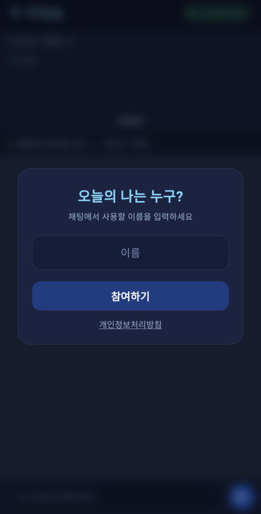
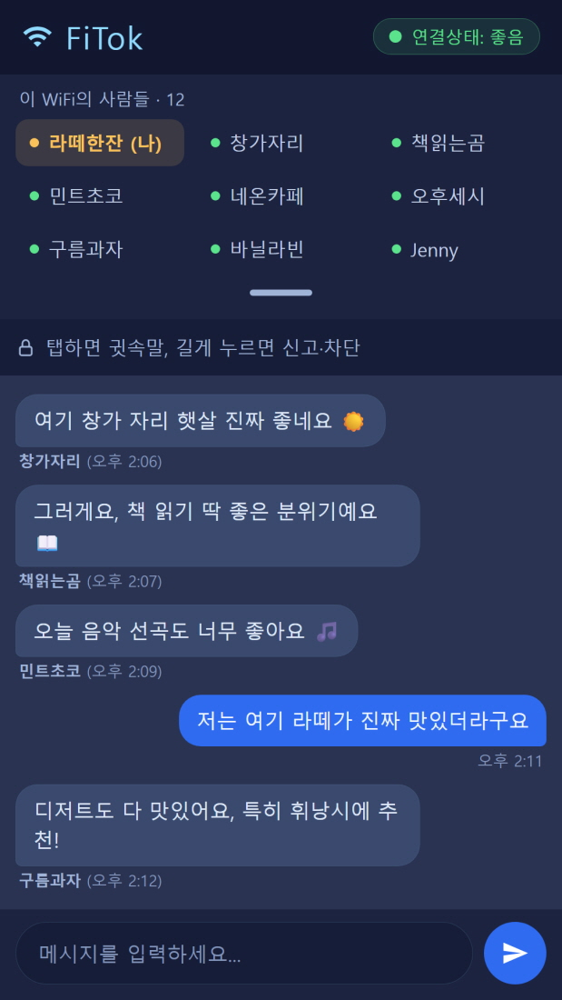
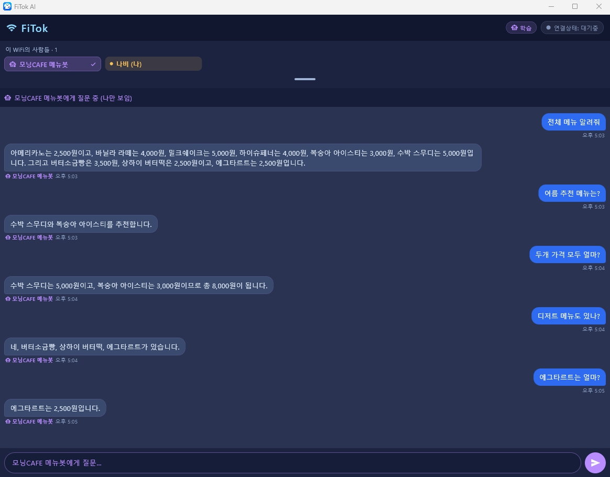
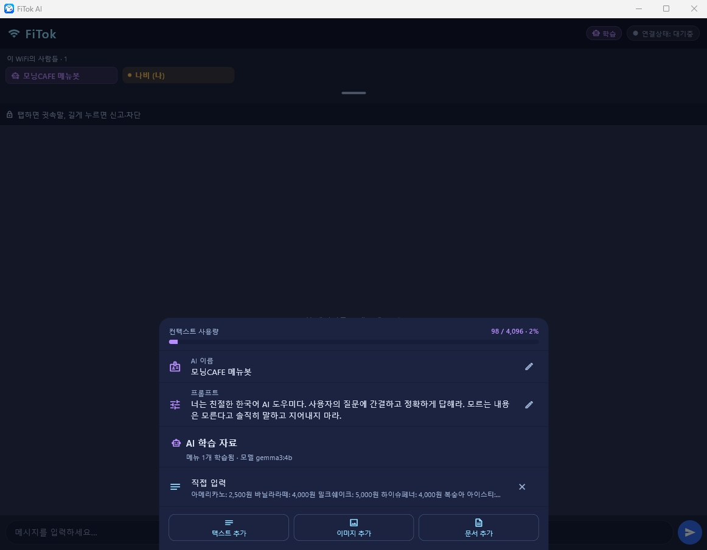

# FiTok

같은 WiFi에 접속한 사람들과 **서버 없이** 채팅하는 Flutter 앱입니다. UDP 멀티캐스트/유니캐스트로
같은 로컬 네트워크의 기기를 자동 발견해 메시지를 주고받으며(LAN P2P), **Windows 버전에는
완전 오프라인으로 동작하는 로컬 AI 챗봇**이 탑재되어 접속자들의 질문에 자동으로 답합니다.

---

## 1. 앱 설명

### 안드로이드 앱
- 같은 WiFi에 접속한 사람들을 자동으로 발견해 자유롭게 대화하는 **LAN P2P 채팅 클라이언트**입니다.
- 별도의 서버나 회원가입 없이, 앱 실행 시 입력한 이름만으로 바로 참여합니다.
- 전체 대화는 물론, 특정 사용자를 선택해 **귓속말(DM)** 도 보낼 수 있습니다.

### 윈도우 앱
- 모바일과 **동일한 LAN P2P 채팅 기능**을 제공하는 데스크톱 클라이언트입니다.
- 여기에 더해 **로컬 AI 챗봇**이 채팅방에 상주합니다. 인터넷 없이 PC에서 직접 구동되는
  AI 엔진(Ollama + Gemma 3)이 접속자들의 질문에 자동으로 응답합니다.
- 운영자가 AI의 이름·성향과 학습 자료(메뉴판, 문서 등)를 등록해두면, AI가 그 자료를
  근거로 손님/접속자의 질문에 답하는 **무인 안내 도우미**로 활용할 수 있습니다.

---

## 2. 기술 스택

### 안드로이드 앱
- **Flutter / Dart** — 단일 코드베이스 UI
- **UDP 소켓 (dart:io)** — 서버 없는 P2P 메시징 (브로드캐스트 + 멀티캐스트 발견, 유니캐스트 연결 유지)
- **network_info_plus** — 접속 중인 WiFi(SSID)·서브넷 브로드캐스트 주소 조회
- **MulticastLock (Android)** — 멀티캐스트 패킷 수신을 위한 네이티브 잠금
- **flutter_localizations / intl** — 한국어·영어 다국어(L10n) 지원

### 윈도우 앱
- 위 모바일 스택 **전체 공유** (동일한 LAN P2P 코어)
- **Ollama (CPU 전용 엔진 동봉)** — 로컬 추론 서버. 설치 파일에 `ollama.exe`를 함께 배포
- **Gemma 3 4B (Q4, ~3.3GB)** — 한국어 품질·상업 라이선스를 고려해 선택한 기본 모델.
  **첫 실행 시 1회 다운로드** 후 완전 오프라인 동작
- **Windows.Media.Ocr** — 메뉴판 등 이미지에서 텍스트 추출(OCR, PowerShell 헬퍼 연동)
- **Windows.Data.Pdf** — PDF를 렌더링 후 OCR/텍스트 추출하여 학습 자료로 수집
- **로컬 Knowledge Store** — 등록된 자료를 토큰 단위로 관리하고 AI 시스템 프롬프트로 주입

### 네트워킹 동작 방식 (요약)

약속된 채널로 통신을 위해 포트 `47474(하드코딩)`에서 동작하며 **발견(broadcast/multicast)과 유지(unicast)를 분리**한 
하이브리드 방식입니다.
신규 발견은 group 주소(서브넷 브로드캐스트 → 제한 브로드캐스트 → 멀티캐스트 `239.7.7.71(하드코딩)`)로,
한 번 연결된 peer는 기억한 유니캐스트 IP로 직접 통신해 연결을 안정적으로 유지합니다.

### 연결 팁

- 같은 WiFi(같은 서브넷)에 연결된 **기기 2대 이상**에서 실행해야 서로 보입니다.
- 일부 공용 WiFi/AP는 "클라이언트 격리(AP isolation)"로 기기 간 통신이 차단될 수 있습니다.
  이 경우 가정용 공유기나 휴대폰 핫스팟으로 테스트하세요.

---

## 3. 화면별 기능 소개

### 안드로이드 앱

#### 1. 로그인

앱 실행 시 표시되는 로그인 화면입니다. 채팅에 사용할 이름을 입력하면 채팅방에 참여합니다.
이름을 입력해야 참여 버튼이 활성화되며, 뒤의 메인 화면은 흐리게(blur) 처리됩니다.

#### 2. 채팅 화면

동일한 네트워크상의 사람들과 자유롭게 대화를 나누는 화면입니다. 상단에 접속 중인 WiFi 이름과
실시간으로 갱신되는 접속자 목록이 표시되고, 특정 사용자를 선택하면 그 사람에게만 가는 귓속말(DM)을
보낼 수 있습니다.

### 윈도우 앱

#### 1. 채팅 화면

모바일과 동일한 채팅 기능을 제공하며, **AI 챗봇이 탑재**되어 있습니다. 접속자들의 질문에 AI가
등록된 학습 자료를 근거로 자동으로 대응합니다.

#### 2. AI 설정 화면

AI의 **이름과 성향**을 입력하고 **학습 자료를 등록**하는 화면입니다. 이미지(OCR)·PDF·문서·직접
입력 등으로 자료를 추가하면 AI가 이를 바탕으로 질문에 대응합니다.

---

> **Windows AI 첫 실행:** 최초 1회 모델(Gemma 3 4B, ~3.3GB) 다운로드가 진행됩니다.
> 이후에는 인터넷 없이 오프라인으로 동작합니다.